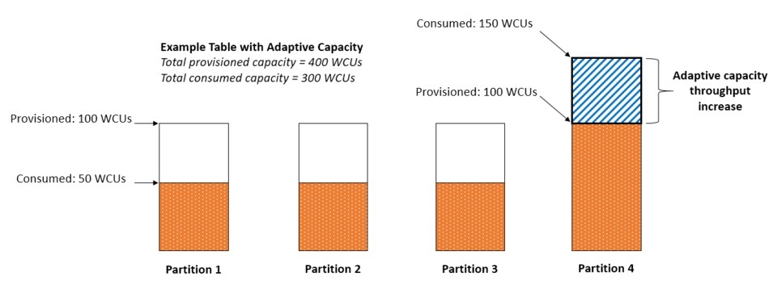

## DynamoDB的分区与存储的注意事项

实际设置的读容量／最大读支持3000 + 实际设置的写容量／最大写支持1000 所得结果想上取整。

即：(readCapacityUnits / 3000) + (writeCapacityUnits / 1000) = RoundUp(initPartitions).

比如实际设置了1000个读和500个写，那么

```
(1000 / 3000 ) + ( 500 / 1000) = RoundUp(5/6) = 1。
```
所以分区的初始值就为1。

必要的时候，DynamoDB会自动拆分现有的分区，提供更多的分区以支撑吞吐。

单个分区可以保存10G的数据，当数据由于写入不均衡时，可能造成某些分区超过存储限制10G，这时DynamoDB将会拆分分区。


其具体步骤为：

DynamoDB将会分配两个新的分区。
DynamoDB会将原分区的数据平均分配到新的分区。
DynamoDB不再给原分区分配数据。
什么时候会执行拆分呢？当吞吐量设置增加，存储要求提高时，都会触发DynamoDB的拆分区操作。

如果当前表分区不能满足新的预置吞吐量时，DynamoDB将会将当前的分区数量扩充一倍。

比如当前读容量为5000，写容量为2000时，DynamoDB设置的分区数为：

```
( 5000 / 3000) + (2000 / 1000) = 3.667 -> 4。
```

如果将读容量从5000调整到8000时，按分区计算公式：[(8000/3000)+(2000/1000)->5]。 4个分区就不能满足了，DynamoDB就会将分区数据量翻倍。如下图所示：


如果某个分区的数据量超过了限制10G，DynamoDB将会把这个分区拆成两个，并且数据将会平均分配到两个新的分区中。如图所示：


上图红框分区填满后，DynamoDB的策略将会把该分区拆除两个分区，拆之前的容量大小为80G，拆后的总容量大小为90G。

这里会有一个坑：

DynamoDB拆分出的分区只会共享原分区的读写吞吐。比如：

开始的时候创建5000读和2000写，DynamoDB会创建4个分区：
```
( 5000 / 3000) + (2000 / 1000) = 3.667 -> 4。
```

每个分区的读写容量为：

5000/4 partitions = 1250

2000/4 partitions = 500

当一个分区拆分成两个分区以后，读写将会被平分：

1250 ／ 2 = 625 读

500 ／ 2 = 250 写。

如果分区键没有打散造成分区写入偏移，就会造成DynamoDB从一个分区创建出过多的分区，这样随着DynamoDB拆分，实际上每个分区可用的读写容量会越来越少。会导致性能的严重下降。


### 将吞吐容量提高到高流量分区

不可能总是均匀地分布读活动和写活动。当数据访问不平衡时，与其他分区相比，“热”分区可以接收更高的读取和写入流量。在极端情况下，如果单个分区接收的流量超出 3000 RCU 或 1000 WCU，就会出现限制。

为了更好地适应不均匀的访问模式，DynamoDB 适应性容量允许您的应用程序继续不受限地对热分区进行读写操作，前提是流量未超出表的预配置的总容量或分区最大容量。自适应容量的工作原理是，自动实时增加分区的吞吐量容量来接收更多流量。

下图说明了适应性容量的工作方式。示例表配置了 400 个 WCU，这些容量单位均匀分布在 4 个分区中，每个分区每秒可以承受最多 100 个 WCU。分区 1、2 和 3 各自每秒接收的写入流量为 50 个 WCU。分区 4 每秒接收 150 个 WCU。此热分区可以在接受写入流量的同时仍具有未利用的突增容量，但是，它最终将会限制每秒超过 100 个 WCU 的流量。

DynamoDB 适应性容量通过增加分区 4 的容量来做出响应，因此分区 4 可以接收 150 WCU/秒的更高工作负载，而不会受到限制。



* [分区设计](https://docs.aws.amazon.com/zh_cn/amazondynamodb/latest/developerguide/bp-partition-key-design.html#bp-partition-key-partitions-adaptive-split)