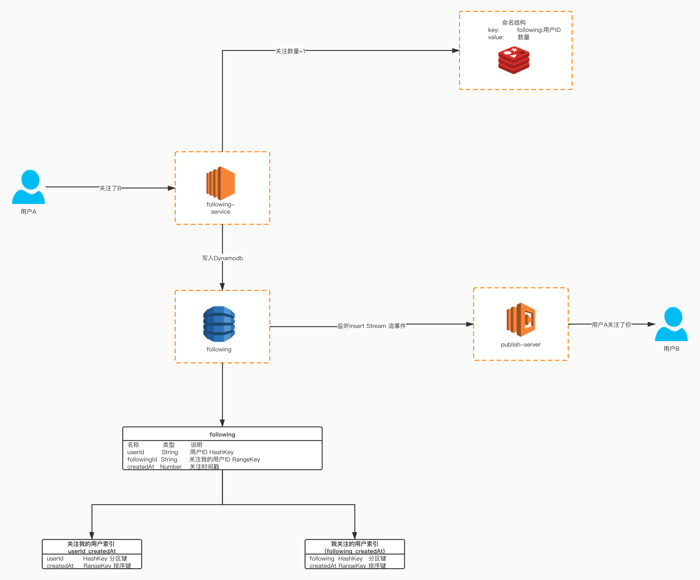

## Dynamodb实现关注系统

### 介绍

关注在社交类平台中，作为一个最常见的操作，每天会有成千上万的操作。如果每次都将操作写入数据库，那么对于数据库会形成很大的操作负担。本文介绍如何通过Dynamodb构建一个关注系统。

### 为什么选择Dynamodb

1. 存储扩展,无需考虑扩容问题
2. 读取扩展,无需考虑扩容问题
3. 价格低廉
4. 天然支持排序
5. 支持游标分页,适合下拉内容

### 架构图



#### 表结构设计

|名称|类型|说明|
|---|---|---|
|userId|String|用户ID HashKey|
|followingId|String|关注我的用户ID RangeKey|
|createdAt|Number|关注时间|

#### 关注我的用户索引(userId_createdAt)

> 查询关注我的用户,按照时间倒序

|名称|说明|
|---|---|
|userId|HashKey 分区键|
|createdAt|RangeKey 排序键|


#### 我关注的用户索引(following_createdAt)

> 查询我关注的用户,按照时间倒序

|名称|说明|
|---|---|
|following|HashKey 分区键|
|createdAt|RangeKey 排序键|


### 启动一个本地的Dynamodb

```
docker run -d -p 8000:8000 ryanratcliff/dynamodb
```

#### 安装依赖包

```
pip install boto3
```

#### 创建表
```
def create_table(client):
    client.create_table(
        TableName='liking',
        KeySchema=[
            { 
                'AttributeName': "id", 
                'KeyType': "HASH"
            }
        ],
        AttributeDefinitions=[
            { 
                'AttributeName': "userId", 
                'AttributeType': "S" 
            }
        ],
        ProvisionedThroughput={       
            'ReadCapacityUnits': 5, 
            'WriteCapacityUnits': 5
        }
    )
```


#### 创建索引
```
def created_index(client):
    client.update_table(
        TableName='liking',
        GlobalSecondaryIndexUpdates=[
            {
                'Create': {
                    'IndexName': "objectId_createdAt",
                    'KeySchema': [
                        {'AttributeName': "objectId", 'KeyType': "HASH"},  
                        {'AttributeName': "createdAt", 'KeyType': "RANGE"},
                    ],
                    'Projection': {
                        "ProjectionType": "ALL"
                    },
                    'ProvisionedThroughput': {
                        "ReadCapacityUnits": 10,
                        "WriteCapacityUnits": 10
                    }
                }
            },
            {
                'Create': {
                    'IndexName': "userId_createdAt",
                    'KeySchema': [
                        {'AttributeName': "userId", 'KeyType': "HASH"},  
                        {'AttributeName': "createdAt", 'KeyType': "RANGE"},
                    ],
                    'Projection': {
                        "ProjectionType": "ALL"
                    },
                    'ProvisionedThroughput': {
                        "ReadCapacityUnits": 10,
                        "WriteCapacityUnits": 10
                    }
                }
            }
        ]
    )
)
```

#### 写入测试数据

```
def importData(client):
    # 使用时间戳代替rank,正式环境请使用snowflake算法生成有序rank
    for i in range(100):
        created_at = int(round(time.time() * 1000))
        rank = int(round(time.time() * 1000000))
        item = {'userId':{'S':'1'},'rank':{'N':str(rank)},'id':{'N':str(i)},'kind':{'S':'photo'},'createdAt':{'N':str(created_at)}}
        client.put_item(TableName='home_feed',Item=item)
```

#### 拉取用户瀑布流数据

```
def query(client,user_id,size,lastEvaluatedKey):
    conditions = {
        'userId':{
            'AttributeValueList':[
                {
                    'S': user_id
                }
            ],
            'ComparisonOperator': 'EQ'
        }
    }

    if lastEvaluatedKey!= None:
        return client.query(
                TableName='home_feed',
                Limit=size,
                KeyConditions=conditions,
                ConsistentRead=False,
                ScanIndexForward=False,
                ExclusiveStartKey=lastEvaluatedKey)

    return client.query(
        TableName='home_feed',
        Limit=size,
        KeyConditions=conditions,
        ConsistentRead=False,
        ScanIndexForward=False)

```

#### 主函数
```
endpoint_url = "http://localhost:8000"
access_key = ""  # 本地Dynamodb不需要填写
secret_key = ""
region_name = "us-west-2"
client = boto3.client('dynamodb',
                          endpoint_url=endpoint_url,
                          aws_access_key_id=access_key,
                          aws_secret_access_key=secret_key,
                          region_name=region_name,)
create_table(client)
importData(client)

response = query(client,'1',20,None)
print(json.dumps(response["Items"],indent=4))

#下一页数据,不断的把LastEvaluatedKey进行传递模拟用户下拉数据
response = query(client,'1',20,response['LastEvaluatedKey'])
print(json.dumps(response["Items"],indent=4))
```

#### 完整代码

* [HomeFeed](./src/home_feed.py)